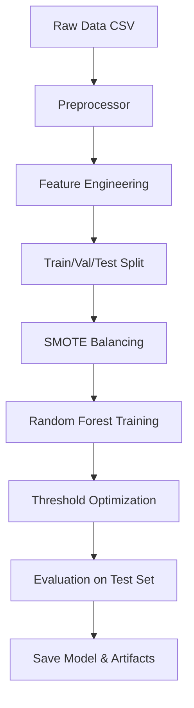
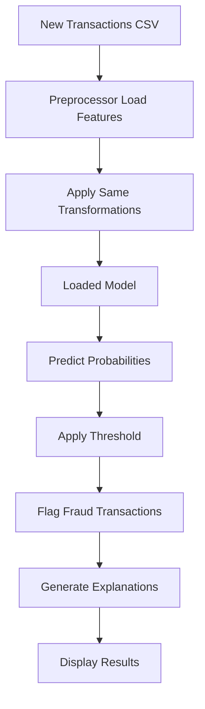

# System Architecture: Fraud Detection AI

## Table of Contents
1. [Overview](#overview)
2. [System Components](#system-components)
3. [ML Pipeline](#ml-pipeline)
4. [Data Flow](#data-flow)
5. [Deployment Architecture](#deployment-architecture)
6. [Technology Stack](#technology-stack)

---

## Overview

The Fraud Detection AI is a production-ready machine learning system designed to detect fraudulent credit card transactions in real-time. The system combines advanced feature engineering, ensemble learning, and interactive visualization in a scalable, cloud-ready architecture.

### Design Principles

- **Modularity**: Separate concerns (preprocessing, training, inference, UI)
- **Scalability**: Horizontal scaling for high-throughput scenarios
- **Explainability**: Transparent predictions for compliance and trust
- **Production-Ready**: Comprehensive error handling, logging, and monitoring
- **User-Friendly**: Intuitive interface for non-technical users

---

## System Components

### 1. Data Preprocessing Module (`src/preprocess.py`)

**Purpose**: Transform raw transaction data into ML-ready features

**Key Features**:
- **Time-Based Engineering**:
  - Hour of day extraction (cyclical encoding with sin/cos)
  - Business hours flag (9 AM - 5 PM)
  - Night transaction flag (10 PM - 6 AM)
  
- **Amount Engineering**:
  - Log transformation: `log1p(amount)`
  - Amount categories: [0-10, 10-100, 100-500, 500+]
  - Squared and square root transformations
  
- **V-Feature Engineering**:
  - Interaction features (V1×V2, V3×V4)
  - Statistical aggregations (mean, std, max, min)
  
- **Data Quality**:
  - Missing value imputation (median)
  - Consistent column ordering
  - Type validation

**Class Structure**:
```python
FraudPreprocessor
├── engineer_features()     # Create new features
├── prepare_features()      # Clean and organize
├── scale_features()        # StandardScaler normalization
└── get_feature_names()     # Feature metadata
```

---

### 2. Model Utilities Module (`src/model_utils.py`)

**Purpose**: Model training, evaluation, and visualization

**Key Components**:

#### FraudDetectionModel Class
- **Training**:
  - Random Forest with optimized hyperparameters
  - Class weighting for imbalance handling
  - Feature importance tracking
  
- **Threshold Optimization**:
  - F1-score maximization
  - High-recall tuning (95%+ recall target)
  - Precision-Recall trade-off analysis
  
- **Evaluation**:
  - Multi-metric assessment (Accuracy, Precision, Recall, F1, AUC)
  - Confusion matrix generation
  - Per-class performance breakdown

#### Visualization Functions
- `plot_confusion_matrix()`: Heatmap with annotations
- `plot_roc_curve()`: ROC with AUC score
- `plot_precision_recall_curve()`: PR curve for imbalanced data
- `plot_feature_importance()`: Top-N feature bar chart

---

### 3. Training Pipeline (`src/train.py`)

**Purpose**: End-to-end model training workflow

**Pipeline Steps**:

```
1. Load Data
   ├── Read creditcard.csv
   ├── Check data quality
   └── Log statistics

2. Preprocess
   ├── Feature engineering
   ├── Train/Val/Test split (60/20/20)
   └── SMOTE balancing (train only)

3. Train Model
   ├── Random Forest (300 trees)
   ├── Hyperparameter tuning
   └── Feature importance extraction

4. Optimize Threshold
   ├── Validate on validation set
   ├── Maximize F1 or Recall
   └── Save optimal threshold

5. Evaluate
   ├── Test set metrics
   ├── Generate visualizations
   └── Save results

6. Save Artifacts
   ├── Model: models/rf_fraud_model.joblib
   ├── Preprocessor: models/*_preprocessor.joblib
   ├── Metrics: assets/model_metrics.csv
   └── Plots: assets/*.png
```

**Configuration**:
- **Model Hyperparameters**:
  - `n_estimators`: 300
  - `max_depth`: 20
  - `min_samples_split`: 10
  - `min_samples_leaf`: 4
  - `max_features`: 'sqrt'
  - `class_weight`: 'balanced'
  
- **SMOTE Parameters**:
  - `k_neighbors`: 5
  - Target ratio: 1:1 (balanced)

---

### 4. Streamlit Application (`app/streamlit_app.py`)

**Purpose**: Interactive web dashboard for fraud detection

**Architecture**:

```
Main App (streamlit_app.py)
├── Model Loading (cached)
├── Page Routing
│   ├── Dashboard Page
│   ├── Explainability Page
│   ├── Metrics Page
│   └── About Page
└── Session State Management
```

**Key Features**:

1. **Dashboard Page**:
   - File upload / sample data generation
   - Real-time prediction
   - Fraud alert banner
   - Summary metrics
   - Multi-tab results view

2. **Explainability Page**:
   - Global feature importance
   - Per-transaction breakdown
   - Risk level categorization
   - Contributing factors

3. **Metrics Page**:
   - Performance dashboard
   - Confusion matrix
   - ROC/PR curves
   - Model metadata

4. **About Page**:
   - Project information
   - Technical stack
   - Deployment options

---

### 5. UI Components (`app/ui_components.py`)

**Purpose**: Reusable, styled UI elements

**Components**:

- **Metric Cards**: Icon-based metrics display
- **Alert Banners**: Color-coded notifications
- **Interactive Charts**:
  - Fraud probability distribution (histogram)
  - Fraud vs Normal (pie chart)
  - Amount distribution (box plot)
  - Time series (line chart)
  - Feature importance (bar chart)
  
- **Data Tables**: Searchable, sortable dataframes
- **Download Buttons**: CSV export functionality
- **Loading Animations**: User feedback during processing
- **Custom CSS**: Professional styling

---

## ML Pipeline

### Training Phase



### Inference Phase



---

## Data Flow

### 1. Input Data Format

**Required Columns**:
- `Time`: Seconds elapsed since first transaction
- `V1-V28`: PCA-transformed features (anonymized)
- `Amount`: Transaction amount in currency units
- `Class`: (Optional) 0 = Normal, 1 = Fraud

**Example**:
```csv
Time,V1,V2,...,V28,Amount,Class
0,-1.359807,-0.072781,...,149.62,0
406,1.191857,0.266151,...,2.69,0
```

### 2. Feature Transformation

**Input Features** (30 columns):
- Time, V1-V28, Amount

**Engineered Features** (~40 columns):
- Original: V1-V28, Amount
- Time features: hour, hour_sin, hour_cos, is_night, is_business_hours
- Amount features: log_amount, amount_category, amount_squared, amount_sqrt
- Interaction features: v_interaction_1, v_interaction_2
- Statistical features: v_mean, v_std, v_max, v_min

### 3. Output Format

**Prediction Results**:
```python
{
    'fraud_probability': float,  # 0.0 to 1.0
    'predicted_fraud': int,      # 0 or 1
    'explanation': {
        'top_features': dict,    # Feature contributions
        'risk_level': str        # HIGH/MEDIUM/LOW
    }
}
```

---

## Deployment Architecture

### Local Development

```
User's Machine
├── Python Environment
├── Streamlit Server (localhost:8501)
├── Model Files (local disk)
└── Browser Client
```

### Docker Deployment

```
Docker Container
├── Python 3.10 Runtime
├── Application Code
├── Streamlit Server
├── Volume Mounts
│   ├── /app/models
│   ├── /app/assets
│   └── /app/logs
└── Port Mapping (8501:8501)
```

### Cloud Deployment (Streamlit Cloud)

```
GitHub Repository
    ↓
Streamlit Cloud
    ├── Auto-build Container
    ├── Managed Hosting
    ├── SSL Certificate
    └── CDN Distribution
    ↓
Public URL (https://yourapp.streamlit.app)
```

### Production Microservices (Future)

```
Client
    ↓
Load Balancer
    ↓
├── API Gateway (FastAPI)
│   ↓
├── Prediction Service (Flask/FastAPI)
│   ├── Model Serving
│   └── Feature Engineering
│   ↓
├── Database (PostgreSQL)
│   ├── Transaction History
│   └── Prediction Logs
│   ↓
└── Monitoring (Prometheus/Grafana)
    ├── Model Performance
    ├── System Metrics
    └── Alerts
```

---

## Technology Stack

### Core ML
- **scikit-learn 1.3+**: Random Forest, metrics, preprocessing
- **imbalanced-learn 0.11+**: SMOTE for class balancing
- **pandas 2.0+**: Data manipulation
- **numpy 1.24+**: Numerical operations
- **joblib 1.3+**: Model serialization

### Web Application
- **Streamlit 1.26+**: Web framework
- **Plotly 5.16+**: Interactive visualizations
- **matplotlib 3.7+**: Static plots
- **seaborn 0.12+**: Statistical visualizations

### Deployment
- **Docker**: Containerization
- **Docker Compose**: Multi-container orchestration
- **Python 3.10**: Runtime environment

### Development
- **Git**: Version control
- **pytest**: Unit testing (future)
- **black**: Code formatting (future)
- **mypy**: Type checking (future)

---

## Performance Characteristics

### Training Performance
- **Time**: 2-3 minutes (280K samples, 300 trees)
- **Memory**: ~2GB RAM
- **CPU**: Multi-core (n_jobs=-1)
- **Disk**: ~50MB (model + assets)

### Inference Performance
- **Latency**: <100ms per batch (1000 samples)
- **Throughput**: 10,000+ transactions/second
- **Memory**: ~500MB (loaded model)
- **Scalability**: Horizontally scalable (stateless)

### Storage Requirements
- **Model**: 20-30 MB
- **Assets**: 5-10 MB (plots)
- **Logs**: Variable (recommend rotation)

---

## Security Considerations

### Data Privacy
- No PII in training data (V1-V28 are PCA-anonymized)
- Secure model storage
- No data retention in demo mode

### API Security (Future)
- JWT authentication
- Rate limiting
- Input validation
- SQL injection prevention

### Deployment Security
- HTTPS only in production
- Environment variable secrets
- Docker security best practices
- Regular dependency updates

---

## Monitoring & Logging

### Application Logging
- **Level**: INFO, WARNING, ERROR
- **Format**: Timestamp, module, level, message
- **Storage**: Console + file (future)

### Model Monitoring (Future)
- Prediction distribution drift
- Feature drift detection
- Performance degradation alerts
- Retraining triggers

### System Metrics
- Request latency
- Error rates
- Model load time
- Memory usage

---

## Future Enhancements

### Short-term (Q1 2024)
- SHAP integration for advanced explainability
- REST API for integration
- PDF report generation
- Enhanced error handling

### Medium-term (Q2 2024)
- Real-time streaming (Kafka integration)
- Database persistence (PostgreSQL)
- User authentication
- Advanced alerting (email/SMS)

### Long-term (Q3 2024)
- Ensemble models (XGBoost + Neural Networks)
- AutoML for hyperparameter tuning
- A/B testing framework
- Multi-channel fraud detection

---

## Conclusion

This architecture provides a solid foundation for production fraud detection:
- ✅ Modular and maintainable
- ✅ Scalable and performant
- ✅ Explainable and transparent
- ✅ Production-ready from day one

The system can be easily extended with new features, integrated with existing systems, and deployed to various cloud platforms.
